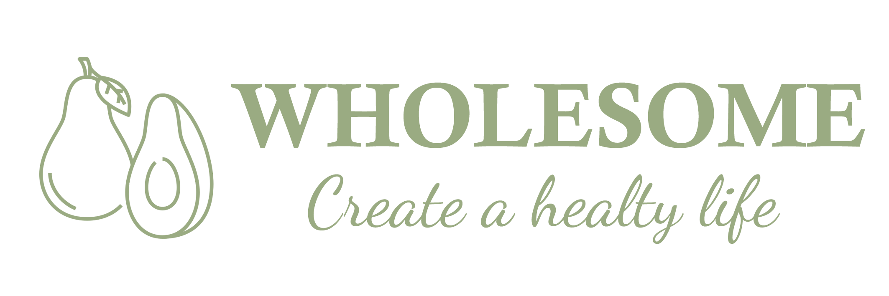

# MFEE27 前端工程師養成班畢業專題 - Wholesome 前端



## 目錄 
* [部屬步驟](#部屬步驟)
* [使用技術](#使用技術)
* [使用套件](#使用套件)
* [參考](#參考)
-------
### 部屬步驟
1. 先將專案從 github 上 clone 到本地端，並安裝套件
```
git clone https://github.com/carolynchiu/wholesome-project.git
npm install
```
2. 安裝完後於檔案根目錄建.env檔，將.env.example檔裡的內容複製到.env檔裡

3. 啟動前端專案
```
npm start
```
**注意**：本倉儲只有運行前端的部分，需要連同後端一起運行，後端請至[Wholesome 後端](https://github.com/carolynchiu/wholesome-backend.git)

### 使用技術
  * 設計/原形工具：Figma
  * 前端：HTML, CSS, Javascript, Axios, Bootstrap 5, SASS
  * 前端框架：React
  * 後端技術：Node.js 16.16.0、Express
  * 資料庫運用/版本控制：MySQL、Git、XAMPP

### 使用套件
  * framer-motion@7.3.6
  * mui material @5.10.3
  * swiper@8.3.2
  * sweetalert2@11.4.33

### 參考 
網站的整體設計概念參考
[機本生活](https://www.olifefood.com/)
 
